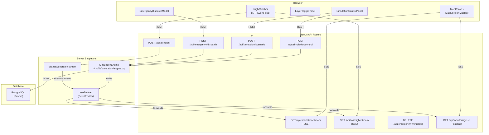

# Design Document: STMS Simulation Refactor

## Overview

The STMS Simulation Refactor transforms the existing Smart Traffic Management System into a live city traffic simulation platform centred on the fictional Meridian City. The refactor is additive — all 113 existing tests must continue to pass. The key additions are:

1. A **Map Provider Abstraction** that replaces the SVG prototype map with a real WebGL map (MapLibre GL JS by default, Mapbox GL JS when a token is present).
2. A **Simulation Engine** — a server-side singleton that generates algorithmic traffic observations on a configurable tick interval, with zone-based profiles, cascade logic, and scenario presets.
3. A **Command-Centre UI** — the `/map` page becomes a full-viewport dashboard with floating panels for simulation control, layer toggles, AI insights, event feed, and emergency dispatch.
4. An **Emergency Vehicle Priority** system with signal preemption and animated map visualisation.
5. An **AI Analyst Panel** that streams natural-language traffic insights from Ollama token-by-token.
6. A **Meridian City seed dataset** — 18+ named road segments with GeoJSON geometry, 11+ intersections at ~18.5°N 73.8°E, and all supporting data.

The design follows the existing patterns: Next.js App Router, Prisma + PostgreSQL, SSE via `sseEmitter`, NextAuth.js credentials, and the clay design system.

---

## Architecture



### Key Architectural Decisions

- **Map provider is a runtime decision**: `MapProviderFactory` checks `process.env.NEXT_PUBLIC_MAPBOX_TOKEN` at module load time and returns the correct adapter. No other file imports either GL library.
- **Simulation Engine is a Node.js singleton**: Stored in `globalThis.__simulationEngine` to survive Next.js hot-reload, identical to the existing `sseEmitter` pattern.
- **In-memory simulation state**: Active scenarios, emergency vehicles, and cascade overrides live in-memory inside the engine. Only `traffic_observations` and `incidents` are persisted to the database.
- **SSE fan-out**: All real-time events (tick, scenario, emergency, AI tokens) flow through the existing `sseEmitter`. New event types are added to `SSEEventType`; new SSE route handlers filter by event type.
- **Existing tests are unaffected**: The simulation engine, map provider, and new API routes are entirely new files. Existing query wrappers, signal optimizer, and auth logic are unchanged except for the auth redirect.

---

## Components and Interfaces

### Map Provider Abstraction

```typescript
// src/lib/map/IMapProvider.ts
export interface IMapProvider {
  addSource(id: string, source: GeoJSONSourceSpecification): void
  removeSource(id: string): void
  addLayer(layer: LayerSpecification): void
  removeLayer(id: string): void
  setFeatureState(feature: FeatureIdentifier, state: Record<string, unknown>): void
  flyTo(options: FlyToOptions): void
  on(event: 'click', layerId: string, handler: (e: MapMouseEvent) => void): void
  on(event: 'contextmenu', layerId: string, handler: (e: MapMouseEvent) => void): void
  off(event: string, layerId: string, handler: (e: MapMouseEvent) => void): void
  getCanvas(): HTMLCanvasElement
  resize(): void
  remove(): void
}

// src/lib/map/MapProviderFactory.ts
export function createMapProvider(
  container: HTMLElement,
  options: MapInitOptions
): IMapProvider {
  const token = process.env.NEXT_PUBLIC_MAPBOX_TOKEN
  if (token) {
    return new MapboxAdapter(container, { ...options, token })
  }
  return new MapLibreAdapter(container, options)
}
```

**MapLibreAdapter** wraps `maplibre-gl` and delegates all `IMapProvider` calls to the underlying `maplibregl.Map` instance. The default style is `https://basemaps.cartocdn.com/gl/dark-matter-gl-style/style.json`.

**MapboxAdapter** wraps `mapbox-gl` and delegates to `mapboxgl.Map`. Style: `mapbox://styles/mapbox/dark-v11`.

Both adapters are loaded via `next/dynamic` with `{ ssr: false }` inside `MapCanvas`.

### React Context

```typescript
// src/contexts/MapProviderContext.tsx
const MapProviderContext = createContext<IMapProvider | null>(null)
export const useMapProvider = () => useContext(MapProviderContext)
```

`MapCanvas` creates the provider instance and wraps all child panels in `MapProviderContext.Provider`.

### Simulation Engine

```typescript
// src/lib/simulation/engine.ts
export type SimulationState = 'STOPPED' | 'RUNNING' | 'PAUSED'

export class SimulationEngine {
  private state: SimulationState = 'STOPPED'
  private speed: number = 1
  private simulatedMinutes: number = 360 // 06:00
  private tickTimer: ReturnType<typeof setInterval> | null = null
  private activeScenarios: Map<string, ActiveScenario> = new Map()
  private cascadeOverrides: Map<string, number> = new Map() // segmentId -> vehicleCount override
  private emergencyVehicles: Map<string, EmergencyVehicle> = new Map()

  play(speed?: number): void
  pause(): void
  reset(): void
  triggerScenario(type: ScenarioType): Promise<void>
  dispatchEmergency(originId: string, destinationId: string): Promise<EmergencyVehicle>
  cancelEmergency(vehicleId: string): void
  getState(): SimulationStatus
  private tick(): Promise<void>
  private generateObservations(): Promise<void>
  private applyCascade(): Promise<void>
  private advanceEmergencyVehicles(): void
}

declare global {
  var __simulationEngine: SimulationEngine | undefined
}

export const simulationEngine: SimulationEngine =
  globalThis.__simulationEngine ?? new SimulationEngine()

if (process.env.NODE_ENV !== 'production') {
  globalThis.__simulationEngine = simulationEngine
}
```

### Zone Profile Functions

```typescript
// src/lib/simulation/zoneProfiles.ts
export type ZoneType = 'residential' | 'commercial' | 'industrial' | 'transit' | 'highway'

export interface ZoneOutput {
  vehicleCount: number
  avgSpeedKmh: number
}

export function getZoneProfile(hour: number, zone: ZoneType): ZoneOutput
```

Each zone profile is a pure function of `(hour, zone)` returning base `vehicleCount` and `avgSpeedKmh`. The engine applies ±15% random variance on top.

### SSE Event Types (extended)

```typescript
// src/lib/sse/emitter.ts — additions
export type SSEEventType =
  // existing...
  | 'simulation:tick'
  | 'simulation:state_change'
  | 'simulation:scenario_update'
  | 'simulation:emergency_update'
  | 'simulation:signal_preemption'
  | 'ai:token'
  | 'ai:insight_complete'
  | 'ai:insight_error'
```

### New API Route Signatures

| Method | Path | Request Body | Response |
|--------|------|-------------|----------|
| POST | `/api/simulation/control` | `{ action: 'play'\|'pause'\|'reset', speed?: 1\|5\|10\|30 }` | `{ state, simulatedTime, speed }` |
| GET | `/api/simulation/stream` | — | SSE stream |
| POST | `/api/simulation/scenario` | `{ scenario: ScenarioType }` | `{ scenarioId, affectedSegments }` |
| POST | `/api/ai/insight` | `{ trigger: TriggerType }` | `{ insightId }` (generation is async via SSE) |
| GET | `/api/ai/insight/stream` | — | SSE stream (ai:token events) |
| POST | `/api/emergency/dispatch` | `{ originId, destinationId }` | `{ vehicleId, route: string[] }` |
| DELETE | `/api/emergency/[vehicleId]` | — | `{ success: true }` |

### UI Component Tree

```
/map page
├── MapCanvas (dynamic, ssr:false)
│   └── MapProviderContext.Provider
│       ├── SegmentLayer        — GeoJSON road segments with congestion colours
│       ├── SignalLayer         — circle markers at intersections (toggleable)
│       ├── IncidentLayer       — pin markers at segment midpoints (toggleable)
│       ├── PredictionLayer     — dashed translucent overlay (toggleable)
│       ├── RouteOverlay        — coloured polylines for computed routes
│       └── EmergencyVehicleMarker — SVG icon moving along route
├── MapHUD (top-left, absolute)
│   └── logo, "Meridian City", SimulatedClock
├── LayerTogglePanel (top-right, absolute)
├── SimulationControlPanel (bottom-left, absolute)
│   ├── Play/Pause button
│   ├── Speed selector (1x/5x/10x/30x)
│   ├── Reset button
│   ├── Scenario dropdown
│   └── Emergency button → EmergencyDispatchModal
├── RightSidebar (collapsible, right edge)
│   ├── AIAnalystPanel
│   │   ├── AIInsightCard (×5 history)
│   │   └── "Ask AI" button
│   └── EventFeed
│       └── EventFeedItem (×N active incidents)
├── SegmentDetailPanel (slide-in, triggered by segment click)
├── IntersectionPopup (map popup, triggered by intersection click)
├── ContextMenu (right-click on segment)
└── ToastNotification (portal)
```

---

## Data Models

### Schema Changes

Two new columns on `road_segments`:

```prisma
model RoadSegment {
  // ... existing fields ...
  zoneType   String[]  @default([]) @map("zone_type")
  floodRisk  Boolean   @default(false) @map("flood_risk")
  // geometry column already exists as String?; migration ensures it is populated
}
```

The `geometry` column already exists in the schema as `String?`. The migration will populate it for all seeded segments and add the two new columns.

The `intersections` table already has `latitude` and `longitude` as non-nullable `Decimal` fields — no schema change needed.

### In-Memory Types

```typescript
// src/lib/simulation/types.ts

export type ScenarioType =
  | 'rush_hour'
  | 'stadium_exodus'
  | 'major_accident'
  | 'flash_flood'

export type TriggerType = 'scheduled' | 'scenario' | 'gridlock_alert' | 'manual'

export interface ActiveScenario {
  id: string
  type: ScenarioType
  startSimTime: number        // simulated minutes since midnight
  durationSimMinutes: number
  affectedSegmentIds: string[]
  incidentIds: string[]       // persisted incident IDs
}

export interface EmergencyVehicle {
  id: string
  route: string[]             // array of intersection IDs
  currentIndex: number        // index into route
  speedKmh: number
  state: 'DISPATCHED' | 'IN_TRANSIT' | 'COMPLETED'
  preemptedSignalIds: string[]
}

export interface SimulationStatus {
  state: SimulationState
  simulatedTime: string       // "HH:MM"
  speed: number
  activeScenarios: string[]
  emergencyVehicleCount: number
}

export interface AIInsight {
  id: string
  trigger: TriggerType
  text: string
  simulatedTime: string
  createdAt: number           // Date.now()
}
```

### Meridian City Seed Data

The seed replaces the existing placeholder data with 18 named road segments, 11 intersections, 4 traffic signals, 2 active incidents, congestion predictions, and route edges. All segments have GeoJSON LineString geometry centred around 18.5°N, 73.8°E.

Named segments include: Central Boulevard, North Ring Road, Station Avenue, Market Street, Harbour Link, Industrial Bypass, Airport Expressway, University Road, Old Town Lane, Tech Park Drive, Stadium Road, Riverside Drive, Commerce Way, Port Access Road, Eastern Connector, Southern Loop, Civic Centre Road, and Waterfront Promenade.

Three segments (`Harbour Link`, `Riverside Drive`, `Waterfront Promenade`) have `flood_risk = true`.

Zone type assignments:
- `highway`: Airport Expressway, North Ring Road, Industrial Bypass
- `transit`: Central Boulevard, Station Avenue, Eastern Connector
- `commercial`: Market Street, Commerce Way, Civic Centre Road
- `residential`: University Road, Old Town Lane, Southern Loop
- `industrial`: Tech Park Drive, Port Access Road, Industrial Bypass
- `stadium` area (transit): Stadium Road, Riverside Drive
- `waterfront` (commercial): Harbour Link, Waterfront Promenade

---

## Correctness Properties

*A property is a characteristic or behavior that should hold true across all valid executions of a system — essentially, a formal statement about what the system should do. Properties serve as the bridge between human-readable specifications and machine-verifiable correctness guarantees.*

### Property 1: Zone profile output is within congestion thresholds

*For any* valid `(hour, zoneType)` pair, the `getZoneProfile` function SHALL return a `vehicleCount` and `avgSpeedKmh` that, when passed through the congestion classification logic, produce a `CongestionLevel` consistent with the zone's expected behaviour at that hour (e.g., residential zones at 03:00 SHALL NOT produce Gridlock).

**Validates: Requirements 7.1, 7.2, 7.3, 7.4, 7.5**

### Property 2: Cascade depth is bounded at 2 hops

*For any* road network graph and any set of Gridlock segments, after one tick of cascade logic, no segment that was not already Gridlock and is more than 2 hops away from a Gridlock segment SHALL have its vehicle count increased by the cascade algorithm.

**Validates: Requirements 11.1, 11.2**

### Property 3: Cascade increase is bounded at Gridlock threshold

*For any* segment receiving a cascade vehicle count increase, the resulting vehicle count SHALL NOT exceed the Gridlock threshold (80 vehicles).

**Validates: Requirements 11.1, 11.2**

### Property 4: Zone profile variance is within ±15%

*For any* base vehicle count produced by `getZoneProfile`, the final vehicle count after applying random variance SHALL be within 15% of the base value (i.e., `base * 0.85 ≤ final ≤ base * 1.15`).

**Validates: Requirements 7.6**

### Property 5: Simulated clock advances monotonically

*For any* sequence of ticks while the engine is in RUNNING state, the simulated clock value SHALL be strictly greater than its value at the previous tick.

**Validates: Requirements 6.10**

### Property 6: Speed multiplier tick interval is correct

*For any* speed multiplier value in `{1, 5, 10, 30}`, the tick interval in milliseconds SHALL equal `30000 / speed`.

**Validates: Requirements 6.3, 6.4, 6.5, 6.6**

### Property 7: AI insight prompt contains required context fields

*For any* call to the AI insight generation function, the constructed prompt string SHALL contain the simulated time, at least 3 segment names with congestion levels, the active incident count, and the worst predicted segment name.

**Validates: Requirements 13.3**

### Property 8: Cascade resolution restores zone-based generation

*For any* segment that was under cascade override, after the triggering incident is resolved, the segment's vehicle count on the next tick SHALL be generated by the zone profile function rather than the cascade override map.

**Validates: Requirements 11.3**

---

## Error Handling

### Map Provider Errors

- If MapLibre fails to load tiles (network error), the map canvas shows a dark background with a non-blocking toast: "Map tiles unavailable — using offline mode".
- If `NEXT_PUBLIC_MAPBOX_TOKEN` is present but invalid, Mapbox emits an `error` event; the adapter catches it and falls back to MapLibre silently.
- Both adapters wrap all `IMapProvider` method calls in try/catch; errors are logged to console and do not propagate to React.

### Simulation Engine Errors

- If a tick throws (e.g., database write fails), the engine logs the error, skips that tick, and continues. The state remains `RUNNING`.
- If `POST /api/simulation/control` receives an invalid action, it returns `400 Bad Request`.
- If the engine is already in the requested state (e.g., `play` when already `RUNNING`), it returns the current status with `200 OK` — idempotent.

### SSE Reconnection

- Clients use `EventSource` with a custom wrapper that implements exponential backoff: 1s → 2s → 4s (max 3 retries).
- After 3 failed reconnections, a "Connection lost" toast is shown. The toast includes a manual "Reconnect" button.
- On successful reconnect, the client re-hydrates state from REST endpoints before resuming SSE.

### AI Analyst Errors

- If Ollama is unreachable, `ollamaGenerate` returns `null` (existing behaviour). The AI panel shows "AI Analyst offline — operating in manual mode".
- If the Ollama response exceeds 200 tokens, the streaming is truncated client-side after the token limit.
- If the SSE stream for AI tokens is interrupted mid-response, the panel shows the partial text with a "…" suffix.

### Emergency Dispatch Errors

- If the Dijkstra router finds no path between origin and destination, `POST /api/emergency/dispatch` returns `422 Unprocessable Entity` with `{ error: "No route found" }`.
- If an emergency vehicle's route becomes invalid (e.g., a segment is removed), the engine completes the dispatch immediately and releases all overrides.

### Database Errors

- All Prisma writes in the simulation engine are wrapped in try/catch. On failure, the engine emits a `system:db-error` SSE event and continues with in-memory state only.
- Scenario-triggered incidents that fail to persist are retried once after 2 seconds; if the retry fails, the scenario continues without the persisted incident.

---

## Testing Strategy

### Unit Tests (example-based)

- `getZoneProfile(hour, zone)` — concrete examples for each zone at peak, off-peak, and night hours.
- `SimulationEngine.getState()` — verify initial state is `STOPPED` with simulated time `06:00`.
- `MapProviderFactory` — mock `process.env.NEXT_PUBLIC_MAPBOX_TOKEN`; verify correct adapter class is returned.
- `POST /api/simulation/control` — example: `{ action: 'play' }` transitions state to `RUNNING`.
- `POST /api/simulation/scenario` — example: `rush_hour` sets commercial/transit segments to Heavy/Gridlock.
- Emergency dispatch — example: valid origin/destination returns a vehicle with a non-empty route.
- AI prompt builder — example: given known segment data, the prompt contains expected substrings.

### Property-Based Tests

The project uses **fast-check** (already a common choice for TypeScript PBT). Each property test runs a minimum of **100 iterations**.

Tag format: `// Feature: stms-simulation-refactor, Property N: <property_text>`

**Property 1** — Zone profile output is within congestion thresholds
```typescript
// Feature: stms-simulation-refactor, Property 1: zone profile output is within congestion thresholds
fc.assert(fc.property(
  fc.integer({ min: 0, max: 23 }),
  fc.constantFrom('residential', 'commercial', 'industrial', 'transit', 'highway'),
  (hour, zone) => {
    const { vehicleCount, avgSpeedKmh } = getZoneProfile(hour, zone)
    return vehicleCount >= 0 && avgSpeedKmh >= 0
  }
), { numRuns: 100 })
```

**Property 2** — Cascade depth is bounded at 2 hops
```typescript
// Feature: stms-simulation-refactor, Property 2: cascade depth is bounded at 2 hops
// Generate random adjacency graphs and gridlock sets; verify no hop-3+ segments are modified
```

**Property 3** — Cascade increase is bounded at Gridlock threshold
```typescript
// Feature: stms-simulation-refactor, Property 3: cascade increase is bounded at Gridlock threshold
// For any segment vehicleCount and 20% increase, result <= 80
```

**Property 4** — Zone profile variance is within ±15%
```typescript
// Feature: stms-simulation-refactor, Property 4: zone profile variance is within ±15%
// Run getZoneProfile 100 times for same inputs; all results within [base*0.85, base*1.15]
```

**Property 5** — Simulated clock advances monotonically
```typescript
// Feature: stms-simulation-refactor, Property 5: simulated clock advances monotonically
// Tick N times; collect simulatedMinutes after each tick; verify strictly increasing
```

**Property 6** — Speed multiplier tick interval is correct
```typescript
// Feature: stms-simulation-refactor, Property 6: speed multiplier tick interval is correct
fc.assert(fc.property(
  fc.constantFrom(1, 5, 10, 30),
  (speed) => getTickIntervalMs(speed) === 30000 / speed
), { numRuns: 100 })
```

**Property 7** — AI insight prompt contains required context fields
```typescript
// Feature: stms-simulation-refactor, Property 7: AI insight prompt contains required context fields
// Generate random segment arrays and incident counts; verify prompt contains all required fields
```

**Property 8** — Cascade resolution restores zone-based generation
```typescript
// Feature: stms-simulation-refactor, Property 8: cascade resolution restores zone-based generation
// Add segment to cascade overrides; resolve incident; verify next tick uses zone profile
```

### Integration Tests

- Full simulation tick cycle: start engine, run 3 ticks, verify `traffic_observations` rows are written to the database.
- SSE stream: connect to `/api/simulation/stream`, trigger a tick, verify `simulation:tick` event is received.
- Emergency dispatch end-to-end: dispatch vehicle, advance ticks until completion, verify all signal overrides are released.
- Scenario persistence: trigger `major_accident`, verify an `Incident` row with type `Accident` exists in the database.

### Regression Tests

All 113 existing tests must pass without modification. The CI pipeline runs `npm test -- --run` before and after the refactor branch is merged.
