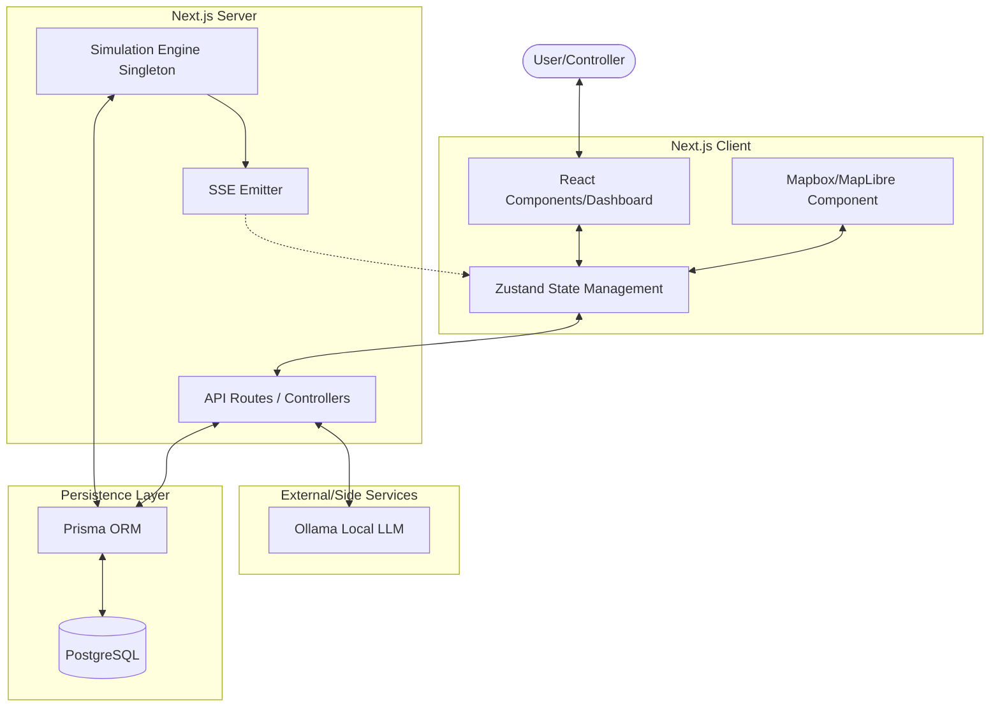
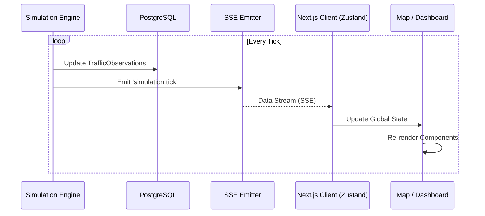

# Technical Architecture

The SMTS platform is built on a modern, full-stack TypeScript architecture designed for high responsiveness and scalability.

## 🏗 Tech Stack

| Layer | Technologies |
| :--- | :--- |
| **Frontend** | Next.js 14 (App Router), React, Zustand (State), Framer Motion (Animations) |
| **Styling** | Tailwind CSS, Lucide React (Icons) |
| **Mapping** | Mapbox GL JS / MapLibre, Custom SVG/Canvas Layers |
| **Backend** | Next.js API Routes, Node.js |
| **Database** | PostgreSQL, Prisma ORM |
| **AI Engine** | Ollama (Local LLM), custom Signal Optimizer & Congestion Predictor |
| **Real-time** | Server-Sent Events (SSE) |
| **Authentication** | NextAuth.js (JWT-based) |

## 🧩 System Component Diagram



## 📁 System Structure

```text
src/
├── app/            # Next.js App Router (Pages, Layouts, API Routes)
├── components/     # Reusable UI components (Shared, Map, Dashboard)
├── lib/            # Core Business Logic
│   ├── ai/         # Signal optimization & LLM prompt engineering
│   ├── simulation/ # Traffic simulation engine & physics
│   ├── map/        # Map provider abstractions
│   ├── sse/        # Real-time event broadcasting logic
│   └── db/         # Prisma client & database utilities
├── store/          # Zustand stores for global state (Traffic, Auth, UI)
├── hooks/          # Custom React hooks (useMap, useTraffic)
└── types/          # Shared TypeScript interfaces & Prisma types
```

## 🔄 Core Data Flows

### 1. Real-time Traffic Updates



1.  The **Simulation Engine** (or real sensors) updates the database with new `TrafficObservation` records.
2.  The **SSE Controller** detects changes and broadcasts updates to connected clients.
3.  The **Zustand Store** updates the UI, causing the Map and HUD to re-render.

### 2. AI Signal Optimization
1.  The `SignalOptimizer` fetches current congestion levels for an intersection.
2.  A structured prompt is sent to the **Ollama** local endpoint.
3.  Ollama returns optimized timing phases.
4.  The platform updates `TrafficSignal` and `SignalPhase` models.
5.  New phases are immediately applied to the map via SSE.

### 3. Authentication & Security
*   Middleware protects `/(dashboard)` routes.
*   NextAuth handles session management and JWT token rotation.
*   Role-based access control (RBAC) ensures only Controllers can override signals.

## 📡 Communication Protocols

*   **REST API**: For standard CRUD operations (Auth, Incidents, Settings).
*   **SSE (Server-Sent Events)**: For low-latency uni-directional data streaming from server to client.
*   **Prisma Client**: Type-safe database access throughout the backend.
