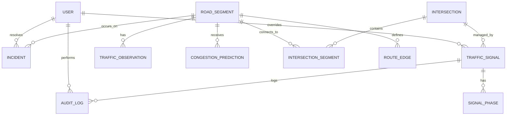

# Database Schema

The system uses a PostgreSQL database with Prisma as the ORM. The schema is designed to handle static infrastructure, dynamic traffic data, and historical audit logs.

## 🗺 Entity Relationship Overview

### 1. Core Infrastructure
*   **User**: System actors (Controllers and Drivers).
*   **RoadSegment**: Individual road paths with speed limits and current congestion status.
*   **Intersection**: Geographical nodes where multiple road segments meet.
*   **IntersectionSegment**: Junction table linking roads to intersections.

### 2. Traffic Control
*   **TrafficSignal**: Represents a signal at an intersection. Tracks online status and AI optimization status.
*   **SignalPhase**: Historical and current timing cycles for signals (Red, Yellow, Green durations).

### 3. Monitoring & Predictions
*   **TrafficObservation**: Snapshots of vehicle count and average speed on a segment.
*   **CongestionPrediction**: AI-generated forecasts of future traffic levels.
*   **Incident**: Active road issues (Accidents, Floods) linked to specific segments.

### 4. Utilities & History
*   **AuditLog**: Immutable record of system actions (Logins, Signal Overrides).
*   **RouteEdge**: Pre-calculated connectivity between segments for pathfinding.

## 🗝 Key Models Detail

### RoadSegment
| Field | Type | Description |
| :--- | :--- | :--- |
| `name` | String | Local name of the road. |
| `lengthMeters` | Decimal | Physical length. |
| `speedLimitKmh`| Int | Allowed speed limit. |
| `currentCongestion`| Enum | Free, Moderate, Heavy, Gridlock. |

### TrafficSignal
| Field | Type | Description |
| :--- | :--- | :--- |
| `aiOptimized` | Boolean | Whether the signal is managed by the LLM. |
| `overrideActive`| Boolean | True if a human controller has manual control. |
| `currentPhase` | Enum | Green, Yellow, Red, Off. |

### Incident
| Field | Type | Description |
| :--- | :--- | :--- |
| `type` | Enum | Accident, Road_Closure, Debris, Flooding. |
| `status` | Enum | Active, Resolved, Escalated. |
| `severity` | Int | 1 (Low) to 5 (Critical). |

## 📊 Enums

*   **CongestionLevel**: `Free`, `Moderate`, `Heavy`, `Gridlock`.
*   **SignalPhaseState**: `Green`, `Yellow`, `Red`, `Off`.
*   **IncidentType**: `Accident`, `Road_Closure`, `Debris`, `Flooding`, `Other`.
*   **UserRole**: `Traffic_Controller`, `Driver`.
