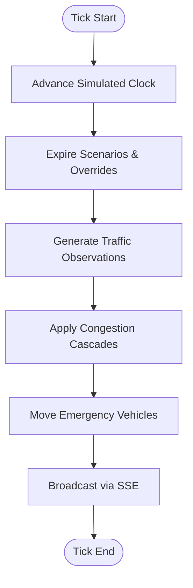

# Simulation Engine

The **Simulation Engine** is the heart of the SMTS platform, responsible for generating realistic traffic patterns and managing dynamic city events. It is a server-side singleton that runs an internal "tick" loop to advance the city's state.

## ⚙️ Core Loop & Mechanics

The engine operates on a **Tick System**. At every tick (default: 1 real second = 1 simulated minute), the following actions occur:
1.  **Clock Advance**: The simulated world clock moves forward.
2.  **Scenario Expiration**: Any active scenarios (like a finished Rush Hour) are cleared.
3.  **Observation Generation**: For every road segment, the engine calculates vehicle density and speed based on **Zone Profiles**.
4.  **Cascade Application**: High congestion on one road "spills over" to adjacent segments.
5.  **Emergency Movement**: Dispatched emergency vehicles move toward their destination index.
6.  **SSE Broadcast**: The updated city state is broadcasted to all connected clients via `simulation:tick`.

## 🏙 Zone Profiles

Traffic generation is not random; it follows realistic urban planning profiles:
*   **Residential**: Peaks in the morning (outward) and evening (inward).
*   **Commercial/Business**: High density during work hours.
*   **Industrial**: Consistent freight traffic, peaks during shift changes.
*   **Highway**: High volume, high speed, high variance.
*   **Transit/Hubs**: Consistent medium density.

## 🎭 Scenario Presets

The engine supports manual and automated triggers for high-impact events:

| Scenario | Impact | Logic |
| :--- | :--- | :--- |
| **Rush Hour** | City-wide congestion | Increases density on all commercial and transit segments. |
| **Stadium Exodus**| Localized gridlock | Creates a "wave" of heavy traffic starting from the stadium segment. |
| **Major Accident** | Segment blockage | Pick a highway segment, set to 'Gridlock', and create an active Incident. |
| **Flash Flood** | Road closures | Targets segments marked with `floodRisk: true`, forcing traffic to re-route. |

## 🚑 Emergency Dispatch System

When an emergency vehicle is dispatched:
1.  **Routing**: The engine runs a **Dijkstra** algorithm over the intersection graph to find the shortest path.
2.  **Preemption**: As the vehicle approaches an intersection, the engine sends a **Signal Preemption** command, forcing the light to Green for the emergency path.
3.  **Narration**: The AI engine generates a natural language broadcast (e.g., *"Ambulance on route, clearing signals on Main St"*).

## 🎛 Controls

The engine state can be manipulated via the **Simulation HUD**:
*   **Play/Pause**: Start or stop the tick loop.
*   **Speed Multiplier**: Accelerate simulation time (1x, 2x, 4x, 8x).
*   **Reset**: Revert the city to its initial 06:00 state and clear all incidents.
